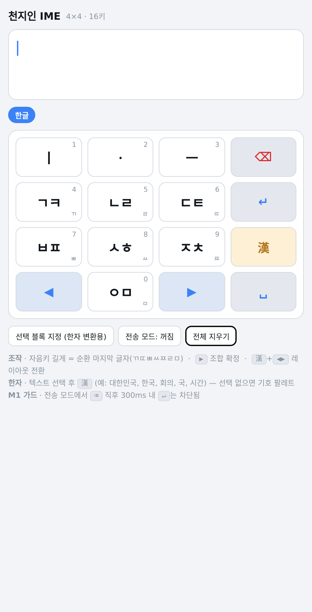
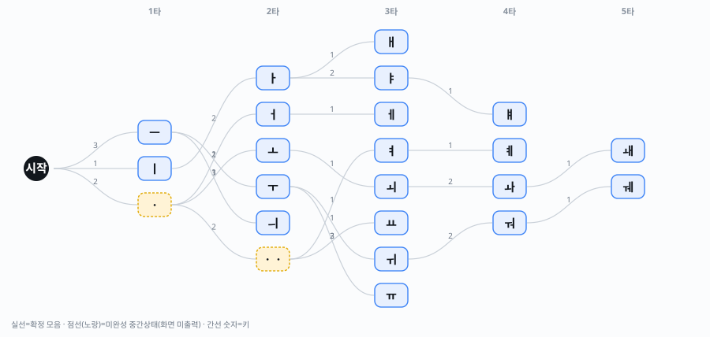

# 천지인 IME — 확정 스펙 (Final Specification)

> **CU-IME v1.0 · 4×4 (16키)** / 2026-08-17
> 본 문서가 **최종 확정본**이며, 01~07 문서의 상충 내용에 우선한다.
> 모든 수치는 참조 구현 실행 결과다. 재현: `tools/verify_final.py`, `ime/core/test.js`

---

## 1. 개요

| 항목 | 내용 |
|---|---|
| 제품명 | Cheonjiin Unified IME (CU-IME) |
| 배열 | 4×4, 16키 (글자 10 + 방향 2 + 한자/기호 1 + ⌫ 1 + ↵ 1 + ␣ 1) |
| 대상 | Windows · macOS · Linux · Android · iOS |
| 조합 방식 | 천지인 (ㆍㅡㅣ 삼재 + 자음 멀티탭) |
| 구현 상태 | **코어·셸 구현 완료, 웹 레퍼런스 동작** |

---

## 2. 확정 키 배치

```
 ┌──────┬──────┬──────┬──────┐
 │  ㅣ  │  ㆍ  │  ㅡ  │  ⌫  │
 ├──────┼──────┼──────┼──────┤
 │ ㄱㅋ │ ㄴㄹ │ ㄷㅌ │  ↵   │
 ├──────┼──────┼──────┼──────┤
 │ ㅂㅍ │ ㅅㅎ │ ㅈㅊ │  漢  │
 ├──────┼──────┼──────┼──────┤
 │  ◀   │ ㅇㅁ │  ▶   │  ␣  │
 └──────┴──────┴──────┴──────┘
```



**배치 근거**
- 글자키 10개가 전화기 키패드와 동일한 3×3+1 형태 → 숫자 레이아웃이 표준 전화기 배치와 완전 일치
- 방향키를 좌우 양끝으로 분리 → 방향 은유와 물리 위치 일치
- 기능키를 우측 세로열에 격리 → 글자 입력 중 파괴적 오터치 방지
- `漢`이 `▶`와 거리 2 → 레이아웃 코드 입력 용이

**⚠️ 알려진 위험**: `⌫`와 `↵`이 인접(거리 1)한다. §7의 M1 가드가 **필수 구현 사항**이다.

---

## 3. 조합 규칙

### 3.1 모음 — 3키로 21자 전체



`ㆍ`·`ㆍㆍ`는 화면에 출력되지 않는 **미완성 중간 상태**다. 현대 한글에 아래아가 없기 때문이며, 이를 구분하지 않으면 `ㄱ`+`ㆍ` 시점에 `가`/`고`로 성급히 확정되는 버그가 생긴다.

| 모음 | 키 | 모음 | 키 | 모음 | 키 |
|---|---|---|---|---|---|
| ㅏ | `12` | ㅗ | `23` | ㅜ | `32` |
| ㅐ | `121` | ㅘ | `2312` | ㅝ | `3212` |
| ㅑ | `122` | ㅙ | `23121` | ㅞ | `32121` |
| ㅒ | `1221` | ㅚ | `231` | ㅟ | `321` |
| ㅓ | `21` | ㅛ | `223` | ㅠ | `322` |
| ㅔ | `211` | ㅡ | `3` | ㅣ | `1` |
| ㅕ | `221` | ㅖ | `2211` | ㅢ | `31` |

### 3.2 자음 — 멀티탭 + 롱프레스

> **확정 규칙: 롱프레스 = 해당 키 순환열의 마지막 항목**

이 단일 규칙이 세 레이아웃 전부를 커버한다.

| 키 | 한글 순환 | 롱프레스 | 영어 (E.161) | 롱프레스 | 숫자 |
|---|---|---|---|---|---|
| `1` | ㅣ | — | . , ? | — | 1 |
| `2` | ㆍ | — | A B C | C | 2 |
| `3` | ㅡ | — | D E F | F | 3 |
| `4` | ㄱ→ㅋ→ㄲ | **ㄲ** | G H I | I | 4 |
| `5` | ㄴ→ㄹ | **ㄹ** | J K L | L | 5 |
| `6` | ㄷ→ㅌ→ㄸ | **ㄸ** | M N O | O | 6 |
| `7` | ㅂ→ㅍ→ㅃ | **ㅃ** | P Q R S | **S** | 7 |
| `8` | ㅅ→ㅎ→ㅆ | **ㅆ** | T U V | V | 8 |
| `9` | ㅈ→ㅊ→ㅉ | **ㅉ** | W X Y Z | **Z** | 9 |
| `0` | ㅇ→ㅁ | **ㅁ** | ⇧ (shift) | — | 0 |

모음키는 순환이 없으므로 롱프레스 미할당(무동작)이다. **롱프레스로 숫자를 입력하지 않는다** — 숫자 레이아웃이 2타로 도달 가능하고 0~9 전부를 1타로 처리하므로 불완전한 롱프레스 숫자는 불필요하다.

### 3.3 겹받침 11종

`ㄳ ㄵ ㄶ ㄺ ㄻ ㄼ ㄽ ㄾ ㄿ ㅀ ㅄ` 전부 입력 가능하다.

**핵심 규칙**: 획추가·쌍자음이 겹받침에 적용될 때 **마지막 성분에만** 작용한다. 이 규칙이 없으면 `밟` 대신 `뱖`이 나온다(구현 중 실제 발생한 버그).

### 3.4 연음 (도깨비불)

받침 뒤 모음 입력 시 받침이 다음 글자 초성으로 이동한다. 겹받침이면 뒤 성분만 이동한다.

### 3.5 백스페이스 — 자모 역추적

글자 단위가 아닌 **마지막 입력 1개만** 취소한다.

| 입력 후 ⌫ | 결과 |
|---|---|
| `4125` (각) | 가 |
| `4231` (괴) | 고 |
| `512` (나) | **니** ← `ㄴ` 아님 |

---

## 4. 방향키 — 문맥 의존 4중 동작

| 문맥 | `◀` / `▶` 동작 |
|---|---|
| `漢` 누른 상태 (코드) | **레이아웃 전환** (역방향 / 정방향) |
| 한자 후보창 열림 | 후보 탐색 |
| 기호 팔레트 열림 | 페이지 전환 |
| 평상시 (조합 중) | **조합 확정** |
| 평상시 (조합 없음) | 커서 이동 |

### 4.1 `▶`가 멀티탭 타임아웃을 대체한다

음절 **내부** 멀티탭 충돌이 11,172자 전수에서 **0건**임을 확인했다. 모든 충돌은 음절 경계에서만 발생하므로 `▶`(확정)로 100% 대체 가능하다.

이에 따라 **멀티탭 타임아웃을 완전히 끌 수 있다.** 입력이 느린 접근성 사용자에게 타임아웃은 오입력의 주원인인데, 12키 배열로는 불가능했던 선택지다.

---

## 5. 한자/기호 키 (`漢`) — 3중 의미

**누를 때가 아니라 뗄 때 판정한다.** 누르는 순간에는 단독 탭인지 코드의 시작인지 알 수 없기 때문이다.

```
漢 DOWN  →  상태만 기록 (동작 없음)
   ├─ 방향키 눌림  →  레이아웃 전환 + hjConsumed = true
   └─ 漢 UP
        ├─ hjConsumed  →  동작 없음
        ├─ 선택 영역(한글) 있음  →  한자 변환 후보
        └─ 그 외  →  기호 팔레트
```

**`hjConsumed` 플래그는 필수다.** 없으면 `漢`+`▶`로 레이아웃을 바꾸고 손을 뗄 때 기호 팔레트가 같이 뜬다.

| 상황 | 결과 |
|---|---|
| 단독 탭 + 한글 블록 선택 | 한자 변환 후보 (단어 우선 → 글자) |
| 단독 탭 + 선택 없음 | 기호 팔레트 (4×4, 3페이지) |
| 단독 롱프레스 | 기호 팔레트 강제 |
| `漢`+`◀` / `漢`+`▶` | 레이아웃 역방향 / 정방향 |

**우선순위는 코드 > 한자 변환**이다. 블록 선택 중에도 코드를 누르면 레이아웃만 바뀐다.

### 5.1 한자 사전 (실데이터)

데모 사전을 **실제 데이터로 교체**했다.

| 항목 | 값 |
|---|---|
| 한자 | **KS X 1001 4,888자 전체** (음 매핑 5,208건 — 이음동자 포함) |
| 음절 | 474 |
| 단어 | **29,361** (위키낱말사전 덤프 추출 + 수동 검수 227) |
| 파일 크기 | 680KB (`spec/hanja-dict.json`) |

**출처와 생성 경로**

1. **한자 집합** — EUC-KR 코덱으로 KS X 1001 한자 영역(0xCA~0xFD)을 직접 열거. 외부 데이터 불필요, 재현 가능.
2. **한국 한자음** — Unicode Unihan `kHangul` 필드. KS 한자 4,888자가 **100% 매핑**된다.
3. **정렬** — 한국 상용 가중치 > `kGradeLevel`(교육용 학년) > `kUnihanCore2020` > 획수. 호환 한자(U+F900~FAFF)는 후순위.
4. **단어** — 한국어 위키낱말사전 덤프(47MB)에서 추출. `tools/fetch_words.py`

**단어 추출의 3중 필터** (오변환 차단)

| 필터 | 배제 사례 |
|---|---|
| KS X 1001 한자로만 구성 | 일본 신자체 `経済` (15,480건 배제) |
| 표제어 음절 수 == 한자 수 | 길이 불일치 |
| 각 글자의 `kHangul` 음이 음절과 일치 | 우연한 문자열 매칭 (3,827건 배제) |

**동음이의어 처리가 핵심이었다.** 위키는 한 문서에 여러 어원을 담는다 — `전화`에는 `田禾`(밭벼)·`典貨`·`電火`·`電化`·`電話`가 모두 있다. 첫 매칭을 취하면 `전화 → 田禾`, `안전 → 眼前`(눈앞) 같은 결과가 나온다. 모든 후보를 모아 **문서 내 등장 빈도 + 구성 한자 상용도**로 순위를 매겨 해소했다(3,329건).

일본 신자체만 실린 표제어(`교육 → 教育`)는 정자 변환표로 폴백한다(842건 교정).

**Java 상수 풀 한계**: 단어 3만 규모를 개별 문자열 리터럴로 두면 클래스 상수 풀(65,535)을 초과한다. 큰 블롭을 런타임에 1회 파싱하는 방식으로 회피했다(`StringBuilder` 결합 — `+` 연결은 컴파일 시 다시 하나의 거대 상수가 되어 실패).

정렬이 중요하다. `kGradeLevel`만 쓰면 `한`의 첫 후보가 `汗`(땀)이 되어 실사용에 나쁘다. 한국 상용 한자 가중치를 얹어 `韓 漢 汗…` 순으로 교정했다.

```
한 → 韓 漢 汗 閒 限 恨 寒 旱      대 → 大 待 代 對 隊 帶 袋 臺
국 → 國 局 菊 鞠 鞫 麴            인 → 人 認 因 引 印 忍 仁 鱗
```

**단일 출처 원칙**: `spec/hanja-dict.json` 하나에서 `tools/gen_hanja.py`가 JS·Java·C++ 사전 소스를 생성한다. 손으로 고치지 않는다.

4개 언어 조회 결과 MD5 일치 (질의 29,835건)

### 5.2 레이아웃 순환

```
한글 ──▶── 영어 ──▶── 숫자 ──▶── (한글)
```

기능키 4개와 방향키 2개는 세 레이아웃에서 **위치·기능이 완전히 동일**하다.

---

## 6. 성능 (실측)

| 지표 | 값 |
|---|---|
| 현대 한글 전수 검증 | **11,172자 / 실패 0건** |
| 평균 타수 (멀티탭만) | 7.026타/자 |
| **평균 타수 (롱프레스 적용)** | **5.894타/자** |
| 12키 천지인 대비 | **−11.9%** |
| 두벌식 대비 | 1.418배 (12키는 1.526배) |
| 음절 내부 멀티탭 충돌 | 0건 |

롱프레스 규칙을 **단순화했더니 타수도 7.3% 줄었다**(6.357→5.894). 규칙이 단순해지면서 성능도 좋아진 드문 경우다.

---

## 7. 필수 안전장치 — M1 전송 가드

`⌫`와 `↵`이 인접하므로, 메신저에서 "지우려다 전송"이 발생할 수 있다. `0`키 오터치와 달리 **복구 불가능**하다.

> **M1**: `↵`이 전송으로 동작하는 컨텍스트에서, 직전 300ms 내에 `⌫` 입력이 있었으면 `↵` 1회를 무시하고 경고를 표시한다.

M1은 "지우다가 실수로 전송"이라는 **정확한 실패 모드만** 겨냥하므로 정상 사용을 방해하지 않는다. 구현·검증 완료.

| 보조 완화책 | 내용 |
|---|---|
| M2 | `⌫`는 중립색, `↵`은 강조색으로 시각 분리 |
| M3 | 전송형 `↵` "한 번 더 눌러 전송" 옵션 (기본 꺼짐) |
| M4 | 두 키 경계 ±4dp 터치 판정 편향 |

---

## 8. 구현

### 8.1 구조

```
ime/
├── core/                    JavaScript (웹 · 레퍼런스)
│   ├── cheonjiin.js         조합 엔진 — 순수 상태 머신, 의존성 0
│   ├── shell.js             셸 — 타이머·漢판정·레이아웃·M1 가드
│   ├── hanja.js             한자 사전 (자동 생성)
│   ├── test.js              코어 검증 (11,172자 × 2방식)
│   └── test-shell.js        셸 검증 (28건)
├── android/                 Java (Android IME) — 앱 패키징 완료
│   ├── CheonjiinCore.java   조합 엔진 포팅
│   ├── CheonjiinIME.java    InputMethodService 셸
│   ├── KeypadView.java      4×4 키패드 렌더링 + 터치 판정
│   ├── HanjaDict.java       한자 사전 (자동 생성, 4,888자)
│   ├── AndroidManifest.xml  IME 서비스 등록 (INTERNET 권한 없음)
│   ├── res/xml/method.xml   input-method 서브타입 (ko/en)
│   ├── build.gradle         compileSdk 34 / minSdk 21
│   ├── stub/                Android SDK 스텁 (SDK 없이 타입체크용)
│   ├── CoreTest.java        코어 검증 (+ 공용 벡터 71건)
│   ├── ShellLogicTest.java  셸 로직 검증 (21건)
│   └── KeypadViewTest.java  터치 판정·배치 검증 (25건)
├── macos/                   Objective-C++ (macOS IMK)
│   └── CheonjiinBridge.mm   IMKInputController 브리지 + 검증 20건
├── native/                  C++ (Windows TSF · Linux IBus)
│   ├── cheonjiin.hpp        조합 엔진 포팅 (헤더 온리)
│   ├── shell.hpp            **셸 상태 머신 — 3개 데스크톱 OS 공용**
│   ├── hanja.hpp            한자 사전 (자동 생성)
│   ├── tsf_textservice.cpp  **Windows TSF 텍스트 서비스**
│   ├── ibus_engine.cpp      Linux IBus 바인딩
│   ├── test.cpp             코어 검증
│   ├── test_shell.cpp       셸 검증 (25건)
│   └── test_tsf (스텁)      TSF 키매핑·조합·한자·M1 검증 (25건)
├── e2e/e2e.js               실제 브라우저 E2E (28건)
└── index.html               웹 레퍼런스 구현
```

**코어/셸 경계가 핵심 계약이다.** 코어는 시간을 모른다 — 타이머는 셸이 소유하고 `TIMEOUT` 가상 키로 주입한다. 4개 언어 모두 이 계약을 지킨다.

```
press(state, key) -> state    // 순수 함수. I/O·타이머·전역상태 없음
```

### 8.2 교차 언어 동일성 — G1 실증

목표 G1("플랫폼 간 동일한 키 시퀀스 → 동일한 결과")을 **해시로 증명**했다.
4개 언어가 11,172자 전체의 키 시퀀스를 덤프한 결과:

```
372100db39c6a5e64a6473f451823935  py.txt
372100db39c6a5e64a6473f451823935  js.txt
372100db39c6a5e64a6473f451823935  java.txt
372100db39c6a5e64a6473f451823935  cpp.txt
```

**MD5 완전 일치.** 평균 타수뿐 아니라 *어떤 키를 어떤 순서로 누르는지*까지 바이트 단위로 같다.

### 8.3 검증 현황

| 계층 | 스위트 | 항목 | 결과 |
|---|---|---|---|
| 코어 | Python `verify_final.py` | 배치·롱프레스 규칙 | ✅ 14/14 |
| 코어 | JS `test.js` | 11,172자 × 2방식 | ✅ 0 실패 |
| 코어 | Java `CoreTest.java` | 위 + 공용 벡터 71건 | ✅ 0 실패 |
| 코어 | C++ `test.cpp` | 위 + 공용 벡터 71건 | ✅ 0 실패 |
| 셸 | JS `test-shell.js` | 漢·코드·M1·레이아웃 | ✅ 28/28 |
| 셸 | Java `ShellLogicTest` | 동일 시나리오 | ✅ 21/21 |
| 셸 | C++ `test_shell.cpp` | 동일 시나리오 | ✅ 25/25 |
| UI | Java `KeypadViewTest` | 16키 터치 판정·후보·팔레트 | ✅ 25/25 |
| UI | Android 스텁 컴파일 | `CheonjiinIME`+`KeypadView` 타입체크 | ✅ 통과 |
| 셸 | C++ `test_tsf` (TSF) | 키매핑·숫자패드·조합·한자·M1 | ✅ 25/25 |
| 사전 | 4개 언어 대조 | 701건 조회 해시 | ✅ 일치 |
| 통합 | **E2E (실제 브라우저)** | 렌더링·터치·물리키·한자·M1 | ✅ 28/28 |
| 교차 | `run-all-tests.sh` | 4개 언어 해시 대조 | ✅ 일치 |

전체 실행: `./run-all-tests.sh`

### 8.4 테스트가 잡은 실제 버그

구현 과정에서 **테스트만이 잡을 수 있었던** 결함 3건:

> **① 고아 타이머 (JS, E2E에서 발견)**
> 레이아웃 전환 시 `pad.innerHTML=''`로 DOM을 재생성하는데, 롱프레스 타이머가 파괴된 엘리먼트에 매달려 있었다. `clearTimeout`이 새 엘리먼트를 가리켜 취소에 실패하고, 죽은 타이머가 나중에 발화해 기호 팔레트가 제멋대로 열렸다. 테스트 3건이 연쇄 실패.
> **해결**: 이벤트 위임 + 타이머를 DOM 밖 모듈 스코프로.
> 단위 테스트는 전부 통과했었다 — **실제 렌더링 환경 검증이 필수**임을 보여준다.

> **② 맵 순회 순서 의존 (C++, 교차 검증에서 발견)**
> `PREV`(백스페이스 역추적)를 `std::map`(정렬 순서)으로 순회해 구성했다. JS/Python은 삽입 순서라 결과가 갈렸다: `나`⌫가 `니`가 아니라 `냐`.
> **해결**: 정의 순서를 보존하는 `V_ORDER` 도입.

> **③ BFS 탐색 순서 (C++, 해시 대조에서 발견)**
> ②를 고친 뒤에도 **평균 타수는 5.894로 완전히 같았지만** 해시가 달랐다. `vowelSeq`의 BFS가 `std::map` 순서로 이웃을 방문해, 532자가 *길이는 같지만 다른* 경로를 택했다(`걔` = `K4 K1 K2 K1 K2` vs `K4 K1 K2 K2 K1`).
> **해결**: BFS도 정의 순서(`V_ORD`)를 따르도록.
> **집계 지표만 봤으면 놓쳤을 버그다.** 바이트 단위 대조가 필요한 이유.

②③은 Java에도 잠재해 있었다(`HashMap` 순회 순서 미보장). 우연히 통과하고 있었을 뿐이라 `LinkedHashMap`으로 교체했다.

## 9. 플랫폼 통합

| 플랫폼 | 프레임워크 | 코어 | 셸 | 상태 |
|---|---|---|---|---|
| 웹 | — | `core/cheonjiin.js` | `core/shell.js` | ✅ **동작** |
| Android | InputMethodService | `CheonjiinCore.java` | `CheonjiinIME.java` + `KeypadView.java` | ✅ **앱 패키징 완료** (APK 빌드만 SDK 필요) |
| Linux | IBus | `cheonjiin.hpp` | `ibus_engine.cpp` + `shell.hpp` | ✅ 셸 검증 완료 (ibus 헤더 필요) |
| Windows | TSF (+IMM32) | `cheonjiin.hpp` | `tsf_textservice.cpp` | ✅ **구현 완료** (COM 등록만 MSVC 필요) |
| macOS | InputMethodKit | `cheonjiin.hpp` | `macos/CheonjiinBridge.mm` | ✅ **브리지 완료** (앱 번들만 Xcode 필요) |
| iOS | Keyboard Extension | `CheonjiinCore.swift` | marked text (iOS 13+) | v1.0 |

C++ `Shell` 클래스는 프레임워크 비의존이므로 **Windows TSF·macOS IMK·Linux IBus가 동일 코드를 공유**한다. 각 프레임워크 바인딩(preedit 표시·커밋·타이머 등록)만 얇게 붙이면 된다.

**공용 테스트 벡터 71건을 CI 게이트로 강제**하며, Java·C++ 구현이 이미 통과했다.

---

## 10. 잔여 사항

| # | 항목 | 상태 | 판단 |
|---|---|---|---|
| 1 | 롱프레스 지연 300ms | 잠정 | 실사용 데이터로 250~400ms 조정. 코드 변경 없이 `config.longpressMs`로 튜닝 |
| 2 | ~~iOS marked text 미지원~~ | **해소됨** | setMarkedText 는 iOS 13+ Required 멤버. 정식 preedit 사용, iOS 12 이하만 폴백 |
| 3 | `⌫`↔`↵` 인접 | 완화 완료 | M1 구현·검증 완료. M2~M4는 플랫폼 UI에서 적용 |
| 4 | ~~한자 사전~~ | ✅ **완료** | KS X 1001 4,888자 + 단어 **29,361** (목표 3만 달성) |
| 6 | 실기기 빌드 | ✅ **CI 구성 완료** | `.github/workflows/ci.yml` 7개 잡 — APK·TSF DLL·IBus 바이너리를 아티팩트로 생성 |
| 5 | 물리 키패드 rollover | 설계 완료 | 3단 폴백(동시→순차 500ms→`漢` 더블탭) |

1·2번은 성격상 종결 불가(실측 필요 / 플랫폼 한계)하며, **설계 결함은 없다.**

---

## 11. 문서 관계

| 문서 | 역할 |
|---|---|
| **00 (본 문서)** | **확정 스펙 — 최우선** |
| 01-기획서 | 배경·목표·원칙 (유효) |
| 02-기술스펙 | 조합 알고리즘·플랫폼 상세 (유효, 배치는 본 문서 우선) |
| 03-디자인 | 색상·접근성·반응형 (유효) |
| 04-기능명세 | 인수 기준 AC (유효) |
| 05·06·07 | 16키 전환 과정의 델타 문서 (본 문서로 통합) |
