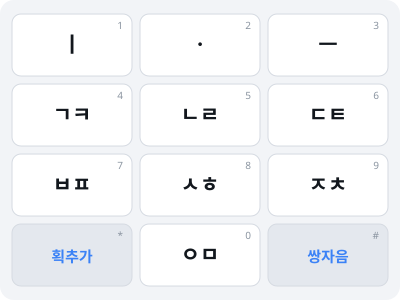
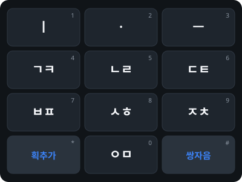

# 천지인 IME — 디자인 명세

> 문서 버전 1.0 / 2026-08-17

---

## 1. 디자인 원칙

**D1. 자판은 읽는 것이 아니라 익히는 것이다.**
숙련 사용자는 키를 보지 않는다. 따라서 시각 디자인의 목표는 "예쁨"이 아니라 **키 경계의 명확성**과 **오타 시 즉시 인지**다. 장식 요소를 배제하고 대비와 간격에 예산을 쓴다.

**D2. 상태를 숨기지 않는다.**
천지인은 멀티탭·조합 상태라는 보이지 않는 문맥이 있다. 사용자가 "지금 몇 번째 탭인지" 헷갈리는 순간 오타가 난다. 순환 상태를 시각화한다(§4).

**D3. 접근성은 나중에 붙이지 않는다.**
타깃 크기·대비·스크린리더 레이블을 초기 스펙에 포함한다. 12키 배열은 접근성상 유리한 출발점이며, 이를 살리는 것이 이 프로젝트의 차별점이다(기획서 P2).

---

## 2. 레이아웃

### 2.1 기본 그리드 (모바일)



3열 × 4행 균등 그리드.

| 항목 | 값 | 근거 |
|---|---|---|
| 키 최소 터치 타깃 | 48 × 48 dp | WCAG 2.2 AA (24px 최소) 및 Material 권장 초과 |
| 실제 키 높이 | 화면 폭에 따라 52–62 dp | 한 손 조작 시 엄지 도달 범위 |
| 키 간격 (gutter) | 8 dp | 인접 키 오터치 방지 |
| 모서리 반경 | 9 dp | — |
| 자판 전체 높이 | 화면 높이의 34–40% | 입력 영역 가림 최소화 |

### 2.2 데스크톱 (Windows / macOS / Linux)

데스크톱에서는 **물리 키보드 매핑을 1순위**로 한다. 화면 자판은 보조 수단이다.

| 입력 수단 | 매핑 |
|---|---|
| 숫자패드 (NumPad) | 1–9, 0 그대로 / `*` 획추가 / `+` 쌍자음 |
| 상단 숫자열 | 1–9, 0 / `-` 획추가 / `=` 쌍자음 |
| 화면 자판 (플로팅) | 드래그 이동 가능, 항상 위 옵션 |

숫자패드 매핑이 핵심이다. 물리 숫자패드의 3×4 배열이 천지인 배열과 **위상적으로 동일**하므로, 모바일 근육 기억이 그대로 전이된다. 이것이 데스크톱 지원의 실질적 가치다.

**주의**: NumPad 배열은 위에서부터 `789 / 456 / 123 / 0`으로, 전화기 배열(`123 / 456 / 789 / *0#`)과 **상하가 뒤집혀 있다.** 설정에서 두 모드를 모두 제공하고, 기본값은 **전화기 배열(논리 매핑)** 로 한다. 즉 NumPad `7`이 천지인 `1`(ㅣ)에 대응한다. 물리 각인과 불일치하지만 근육 기억 전이가 우선이다.

---

## 3. 색상 & 테마

### 3.1 라이트

| 역할 | HEX | 용도 |
|---|---|---|
| 배경 | `#F2F4F7` | 자판 바탕 |
| 키 표면 | `#FFFFFF` | 일반 키 |
| 기능키 표면 | `#E4E8EE` | 획추가/쌍자음 |
| 키 테두리 | `#D5DAE1` | 경계 |
| 주 텍스트 | `#12171D` | 자모 |
| 보조 텍스트 | `#8A94A0` | 숫자 각인 |
| 강조 | `#3B82F6` | 기능키 레이블, 활성 상태 |

### 3.2 다크



| 역할 | HEX |
|---|---|
| 배경 | `#101418` |
| 키 표면 | `#1E252D` |
| 기능키 표면 | `#2A333D` |
| 키 테두리 | `#2E3742` |
| 주 텍스트 | `#F5F7FA` |
| 보조 텍스트 | `#8A94A0` |
| 강조 | `#3B82F6` |

### 3.3 대비 검증

| 조합 | 명도비 | WCAG |
|---|---|---|
| 라이트: `#12171D` on `#FFFFFF` | 17.4:1 | AAA |
| 다크: `#F5F7FA` on `#1E252D` | 14.1:1 | AAA |
| 보조: `#8A94A0` on `#FFFFFF` | 3.1:1 | AA (비텍스트/보조 각인 한정) |

보조 숫자 각인은 3.1:1로 일반 텍스트 AA(4.5:1)에 미달한다. **의도된 선택**이다 — 숫자는 참조용 부가 정보이며, 강조하면 자모 가독성을 해친다. 단, 고대비 모드에서는 `#5A646E`(7.0:1)로 승격한다.

---

## 4. 상태 시각화 (D2의 구현)

### 4.1 멀티탭 순환 인디케이터

자음 키를 연타하는 동안, 해당 키 상단에 **순환 위치 점**을 표시한다.

```
┌─────────────┐
│  ● ○ ○   4  │   1번째 탭 → ㄱ
│    ㄱ       │
└─────────────┘
┌─────────────┐
│  ○ ● ○   4  │   2번째 탭 → ㅋ
│    ㅋ       │
└─────────────┘
```

- 점 개수 = 해당 키의 순환 길이 (ㄴㄹ·ㅇㅁ은 2개, 나머지 3개)
- 키 레이블은 **현재 선택된 자모만** 크게 표시 (평상시엔 전체 표시)
- 타임아웃 임박 시(잔여 200ms) 점이 페이드아웃 → 세션 종료 예고

이 인디케이터가 D2의 핵심이다. 사용자는 "한 번 더 누르면 무엇이 되는지"를 예측할 수 있다.

### 4.2 조합 중 텍스트 (preedit)

| 플랫폼 | 표현 |
|---|---|
| Windows / macOS / Linux / Android | 밑줄 + 배경 하이라이트 `#3B82F6` 12% |
| iOS | **표시 불가** (기술스펙 §7.5) — 대신 자판 상단 미리보기 바 제공 |

iOS의 미리보기 바는 제약에 대한 보상이다. 조합 중인 글자를 자판 위 40dp 영역에 크게 보여준다.

### 4.3 키 피드백

| 이벤트 | 시각 | 햅틱 | 소리 |
|---|---|---|---|
| 일반 탭 | 키 표면 `#3B82F6` 8% 플래시, 80ms | Light (10ms) | 옵션 |
| 멀티탭 순환 | 인디케이터 점 이동 | Light | 옵션 |
| 기능키(획추가/쌍자음) | 강조색 테두리 펄스 | Medium | 옵션 |
| 백스페이스 롱프레스 | 반복 삭제, 가속 | Light 반복 | — |
| 조합 확정 | — | — | — |

**키 팝업(확대 말풍선)은 기본 비활성**이다. 12키는 키가 크므로 팝업의 이득이 적고, 가림 현상만 유발한다. 설정에서 켤 수 있다.

---

## 5. 접근성 명세

### 5.1 스크린리더

각 키의 접근성 레이블은 **현재 순환 상태를 포함**해야 한다.

| 상황 | 레이블 예시 |
|---|---|
| 평상시 `4` 키 | "기역 키읔 쌍기역, 4번" |
| 1탭 후 | "기역 선택됨, 한 번 더 누르면 키읔" |
| 2탭 후 | "키읔 선택됨, 한 번 더 누르면 쌍기역" |
| 획추가 키 | "획 추가, 현재 글자에 획을 더합니다" |

조합 결과는 `LiveRegion`(Android) / `AXAnnouncement`(iOS/macOS)로 실시간 공지한다.

### 5.2 스위치 / 스캐닝 입력

12키는 스캐닝 입력에 유리하다. 행 스캔(4단계) → 열 스캔(3단계)으로 **최대 7스텝**에 임의 키 도달이 가능하다(두벌식 33키는 훨씬 많다).

- 행/열 2단계 스캔 지원
- 스캔 속도 조절 (0.5–3.0초)
- 획추가/쌍자음 키가 있어 멀티탭 반복 스캔을 회피할 수 있다 — 스캐닝 사용자에게 특히 중요

### 5.3 기타

| 항목 | 사양 |
|---|---|
| 동적 글자 크기 | 시스템 설정 연동, 자모 최대 200% 확대 |
| 고대비 모드 | 테두리 2px, 보조 텍스트 승격(§3.3) |
| 모션 감소 | 플래시/펄스 애니메이션 제거, 즉시 상태 전환 |
| 타임아웃 연장 | 멀티탭 800ms → 최대 3000ms 설정 가능 |
| 색맹 대응 | 강조를 색상 단독으로 쓰지 않음 (테두리·굵기 병용) |

---

## 6. 반응형

| 폼팩터 | 대응 |
|---|---|
| 폰 세로 | 기본 3×4 전체 폭 |
| 폰 가로 | 자판 높이 축소, 좌/우 정렬 옵션 (한 손 모드) |
| 태블릿 | 자판 최대 폭 제한(480dp), 좌·우·중앙 정렬 선택 |
| 데스크톱 | 플로팅 패널, 크기 조절 핸들, 물리 키보드 우선 |
| 폴더블 | 접힘 상태 감지, 펼침 시 태블릿 레이아웃 |

한 손 모드는 천지인 사용자에게 특히 유효하다 — 12키는 한 손 엄지 도달 범위에 거의 들어온다.

---

## 7. 에셋

| 파일 | 용도 |
|---|---|
| `assets/keypad-light.svg` | 라이트 테마 자판 |
| `assets/keypad-dark.svg` | 다크 테마 자판 |
| `assets/vowel-automaton.svg` | 모음 조합 상태도 (사용자 교육/온보딩용) |

모음 오토마타 다이어그램은 개발 문서일 뿐 아니라 **온보딩 튜토리얼 자산**으로 재사용한다. "ㅣ에 ㆍ를 더하면 ㅏ"라는 규칙을 그림으로 보여주는 것이 텍스트 설명보다 효과적이다.
