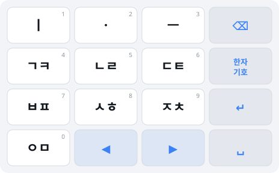

# 천지인 IME — 4×4 (16키) 배열 스펙

> 문서 버전 2.0 / 2026-08-17
> 기존 12키 스펙([02-기술스펙](02-기술스펙.md))의 **변경 델타 문서**. 조합 오토마타·상태 머신·플랫폼 통합은 12키와 동일하며, 여기서는 배열 변경에 따른 차이만 다룬다.
> 검증: `cd tools && python3 verify16.py` → 11,172자 전수, 실패 0건
>
> ⚠️ **키 배치와 롱프레스 규칙은 [07-배치확정·미결검토](07-배치확정-미결검토.md)가 우선한다.**
> 본 문서의 §1(배치도)·§2.2(롱프레스 쌍자음)·§8(미결)은 07에서 갱신됐다.

---

## 1. 키 구성

요구 사양: 글자키 10 + 좌우 방향키 2 + 한자/기호 1 + 백스페이스 1 + 엔터 1 + 스페이스 1 = **16키**



| | 1열 | 2열 | 3열 | 4열 |
|---|---|---|---|---|
| **1행** | ㅣ `1` | ㆍ `2` | ㅡ `3` | ⌫ 백스페이스 |
| **2행** | ㄱㅋㄲ `4` | ㄴㄹ `5` | ㄷㅌㄸ `6` | 한자/기호 |
| **3행** | ㅂㅍㅃ `7` | ㅅㅎㅆ `8` | ㅈㅊㅉ `9` | ↵ 엔터 |
| **4행** | ㅇㅁ `0` | ◀ | ▶ | ␣ 스페이스 |

### 1.1 배치 근거

**글자키 10개는 3×3 + 1 형태로 좌측에 모았다.** 12키 천지인의 `1~9` 배치를 그대로 보존하기 위함이다. 모바일 천지인 숙련자의 근육 기억은 "모음 윗줄, 자음 3×3"이라는 공간 구조에 걸려 있으므로, 이 상대 위치가 유지되면 재학습이 거의 없다.

**기능키 4개를 우측 세로열에 몰았다.** 기능키가 글자키 사이에 섞이면 오타 시 되돌리기 어려운 파괴적 동작(엔터·백스페이스)이 발생한다. 물리적으로 분리된 열에 두면 글자 입력 중 오터치 확률이 크게 낮아진다.

**방향키는 4행 중앙에 나란히 두었다.** 좌우 방향키는 인접해야 방향 감각과 일치한다. `◀ ▶` 순서를 지켜 배치했다.

**⌫를 1행 우측(우상단)에 둔 것은 의도적이다.** 엔터와 최대한 멀리 떨어뜨려야 한다. 둘 다 우측 열에 있지만 1행과 3행으로 2칸 떨어져 있어, 문장 작성 중 가장 치명적인 오타(삭제하려다 전송)를 구조적으로 방지한다.

---

## 2. 12키 대비 핵심 변경: 획추가·쌍자음 키 소멸

12키 배열에는 `*`(획추가)와 `#`(쌍자음)이 있었다. 16키 요구 사양에는 글자키가 10개뿐이므로 **이 두 기능키가 사라진다.**

이는 단순한 키 삭제가 아니라 설계 원칙의 재검토를 요구한다. 12키 스펙의 원칙 P2는 "모호하면 타수를 늘린다 — 획추가/쌍자음으로 타임아웃 없는 결정적 경로를 제공한다"였다. 그 경로가 없어졌다.

### 2.1 잃는 것 — 실측

멀티탭이 유일 경로가 되면서 3단 순환 자모의 타수가 증가한다.

| 자모 | 12키 (기능키 활용) | 16키 (멀티탭 전용) |
|---|---|---|
| ㅋ ㅌ ㅍ ㅊ ㅎ | 2타 | 2타 (동일) |
| **ㄲ ㄸ ㅃ ㅆ ㅉ** | **2타** | **3타** |

전수 실측:

| 배열 | 평균 타수/자 |
|---|---|
| 12키 (기능키 최단 경로) | 6.691 |
| 16키 (멀티탭 전용) | 7.026 |
| **차이** | **+0.335 (+5.0%)** |

손실은 **쌍자음 5개에만 집중**된다. 거센소리(ㅋㅌㅍㅊㅎ)는 원래 멀티탭 2타였으므로 영향이 없다.

### 2.2 되찾는 것 — 롱프레스 쌍자음

쌍자음만 손해라면, 쌍자음만 보상하면 된다. **자음 키 롱프레스 시 해당 계열 쌍자음을 1타로 직접 입력한다.**

| 롱프레스 | 결과 |
|---|---|
| `4` 길게 | ㄲ |
| `6` 길게 | ㄸ |
| `7` 길게 | ㅃ |
| `8` 길게 | ㅆ |
| `9` 길게 | ㅉ |
| `5`, `0` 길게 | (쌍자음 없음 — 숫자 입력) |

실측 결과:

| 방식 | 평균 타수/자 |
|---|---|
| 12키 기능키 활용 | 6.691 |
| 16키 멀티탭 전용 | 7.026 |
| **16키 + 롱프레스 쌍자음** | **6.357** |

**롱프레스를 도입하면 16키가 12키보다 5% 빠르다.** 12키에서 쌍자음은 `키 + #` = 2타였지만, 롱프레스는 1타이기 때문이다. 기능키 2개를 잃고도 순 이득이다.

> 이는 롱프레스 지연(기본 300ms)을 타수로 환산하지 않은 수치다. 물리 시간으로는 대략 등가이며, **손가락 이동 거리는 확실히 줄어든다**(기능키 열까지 왕복할 필요 없음).

---

## 3. 방향키의 이중 역할 (핵심 설계)

16키에서 가장 중요한 발견이다.

### 3.1 문제 — 멀티탭 충돌

멀티탭 방식의 고질적 문제는 같은 키를 연속으로 눌러야 하는 경우다. `ㄱㄱ`을 치려면 `4`를 누르고 → 기다렸다가 → `4`를 눌러야 한다. 이 "기다림"이 천지인 입력의 최대 불만 요소다.

12키에서는 획추가/쌍자음 키가 우회로였다. 16키에는 없다.

### 3.2 해법 — `▶`가 확정 키를 겸한다

**조합 중일 때 `▶`를 누르면 현재 글자를 즉시 확정하고 멀티탭 세션을 끝낸다.** 조합 중이 아니면 평범한 커서 우측 이동으로 동작한다.

```
press(state, "▶"):
    if 조합 중:  현재 글자 확정, 멀티탭 세션 종료
    else:        커서 우측 이동 (셸이 처리)
```

이 동작은 **자연스럽다.** 사용자가 "이 글자 다 썼다"고 느끼는 순간의 손동작이 곧 "다음 칸으로 넘어간다"이기 때문이다. 별도 학습이 필요 없다.

### 3.3 검증 — 타임아웃 완전 대체

12키 스펙에서는 셸이 타이머를 관리해 `TIMEOUT` 가상 키를 주입했다. 16키에서는 `▶`가 그 역할을 대신할 수 있는지 검증했다.

**전제 조건 확인**: 음절 *내부*에서 멀티탭 충돌이 발생하면 `▶`로 대체할 수 없다(글자가 조기 확정되므로). 전수 조사 결과:

```
음절 내부 멀티탭 충돌: 0건 (11,172자 전수)
```

모든 충돌은 **음절 경계에서만** 발생한다. 따라서 `▶`(확정)로 100% 대체 가능하다.

**치환 검증**: 기존 테스트 벡터의 `TIMEOUT`을 전부 `▶`로 바꿔 재실행.

```
전수 11,172자 (TIMEOUT → ▶ 치환): 실패 0건
실전 단어 18종: 실패 0건
```

### 3.4 결과 — 타임아웃을 없앨 수 있다

`▶`가 결정적 확정 수단을 제공하므로, **멀티탭 타임아웃을 선택적으로 완전히 끌 수 있다.**

| 모드 | 동작 | 대상 |
|---|---|---|
| 타임아웃 있음 (기본) | 800ms 후 자동 확정 + `▶` 수동 확정 | 일반 사용자 |
| **타임아웃 없음** | `▶`로만 확정. 무한정 대기 | 숙련자, 접근성 사용자 |

타임아웃 0 모드는 **접근성 측면에서 특히 중요하다.** 운동 장애로 입력이 느린 사용자는 타임아웃이 곧 오입력의 원인이다. `▶`가 있으면 시간 제약을 완전히 제거하면서도 모든 글자를 정확히 입력할 수 있다. 12키 배열로는 불가능했던 것이다.

### 3.5 `◀`의 동작

`◀`도 조합 중이면 먼저 확정한다(조합 상태로 커서를 옮길 수 없으므로). 다만 확정 후 커서를 왼쪽으로 옮기므로, 사용자 의도는 "수정하러 간다"에 가깝다.

| 상황 | `◀` 동작 |
|---|---|
| 조합 중 | 조합 확정 → 커서 좌측 이동 |
| 조합 없음 | 커서 좌측 이동 |

---

## 4. 한자/기호 키

12키 스펙에 없던 신규 기능이다.

### 4.1 동작

| 입력 | 동작 |
|---|---|
| 짧게 누름 | 기호 팔레트 열기 (페이지형) |
| 조합/직전 글자가 한글일 때 짧게 | **한자 변환 후보 표시** |
| 길게 누름 | 기호 팔레트 강제 (한자 변환 건너뜀) |

### 4.2 한자 변환 규칙

1. 변환 대상은 **직전 확정 한글 음절 또는 조합 중 음절**이다.
2. 후보는 자판 상단 바에 표시하며, `◀`/`▶`로 후보를 이동하고 엔터로 선택한다.
   - 이때 방향키는 후보 탐색 모드로 전환되며 커서 이동으로 동작하지 않는다.
3. 후보 없음이면 기호 팔레트로 폴백한다.
4. 변환 사전은 표준 한자음 매핑을 사용한다 (KS X 1001 한자 영역).

### 4.3 기호 팔레트

- 4×4 그리드를 유지하며 페이지 전환
- 1페이지: 자주 쓰는 문장부호 (`. , ? ! ~ … ' " ( ) : ; - / @ #`)
- 2페이지: 수학/단위 (`+ - × ÷ = ± % ° ℃ ₩ $ € ¥ № ※ ★`)
- 3페이지: 괄호/화살표
- 팔레트 내에서도 `◀ ▶`로 페이지 전환

---

## 5. 키별 기능 정의 (전체)

| 키 | 짧게 | 길게 | 조합 중 특수 동작 |
|---|---|---|---|
| `1` ㅣ | ㅣ | 숫자 1 | 모음 오토마타 전이 |
| `2` ㆍ | ㆍ | 숫자 2 | 모음 오토마타 전이 |
| `3` ㅡ | ㅡ | 숫자 3 | 모음 오토마타 전이 |
| `4` | ㄱ→ㅋ→ㄲ 순환 | **ㄲ** | 종성 결합 시도 |
| `5` | ㄴ→ㄹ 순환 | 숫자 5 | 종성 결합 시도 |
| `6` | ㄷ→ㅌ→ㄸ 순환 | **ㄸ** | 종성 결합 시도 |
| `7` | ㅂ→ㅍ→ㅃ 순환 | **ㅃ** | 종성 결합 시도 |
| `8` | ㅅ→ㅎ→ㅆ 순환 | **ㅆ** | 종성 결합 시도 |
| `9` | ㅈ→ㅊ→ㅉ 순환 | **ㅉ** | 종성 결합 시도 |
| `0` | ㅇ→ㅁ 순환 | 숫자 0 | 종성 결합 시도 |
| ⌫ | 자모 1개 삭제 | 반복 삭제(가속) | 오토마타 역전이 |
| 한자/기호 | 한자 변환 / 기호 | 기호 강제 | 조합 음절을 변환 대상으로 |
| ↵ | 엔터 | — | **조합 확정 후** 개행 |
| ◀ | 커서 좌 | 반복 이동 | 조합 확정 후 이동 |
| ▶ | 커서 우 | 반복 이동 | **조합 확정** (멀티탭 종료) |
| ␣ | 공백 | — | 조합 확정 후 공백 |

### 5.1 숫자 입력

12키에서는 별도 숫자 모드가 필요했다. 16키에서는 **모음키·`5`·`0` 롱프레스**로 일부 숫자를 직접 입력할 수 있으나, 1·2·3·5·0만 가능하므로 불완전하다.

따라서 **숫자 전용 모드를 기호 팔레트의 0페이지로 제공**한다. 4×4 그리드에 `0~9` + 소수점 + 사칙연산이 정확히 들어맞는다.

---

## 6. 검증 결과

### 6.1 전수 검증

```
전수 11,172자 (16키, → 확정 방식): 실패 0건
음절 내부 멀티탭 충돌: 0건
평균 타수 (멀티탭 전용): 7.026타/자
평균 타수 (롱프레스 쌍자음): 6.357타/자
```

### 6.2 공용 테스트 벡터

`spec/test-vectors-16key.json` — **71건**

| 카테고리 | 건수 | 내용 |
|---|---|---|
| `vowel` | 21 | 중성 전체 |
| `cho` | 19 | 초성 멀티탭 |
| `cluster` | 11 | 겹받침 |
| `word` | 17 | 실전 단어/문장 |
| `commit` | 3 | `▶` 확정 동작 |

12키 벡터(77건)와 달리 `funckey` 카테고리(12건)가 없고, `timeout` 대신 `commit`이 들어간다.

### 6.3 12키 스펙에서 그대로 유지되는 것

다음은 배열과 무관하므로 변경이 없다:

- 모음 조합 오토마타 (21자, 3키) — [기술스펙 §3](02-기술스펙.md)
- 스냅샷 기반 멀티탭 상태 머신 — [기술스펙 §5.2](02-기술스펙.md)
- 연음(도깨비불) 처리 — [기술스펙 §5.3](02-기술스펙.md)
- 백스페이스 자모 역추적 — [기술스펙 §5.4](02-기술스펙.md)
- 겹받침 11종 및 마지막 성분 규칙 — [기술스펙 §4.3](02-기술스펙.md)
- 플랫폼별 통합 방식 (TSF/IMK/IBus/IMS/iOS) — [기술스펙 §7](02-기술스펙.md)

---

## 7. 설계 원칙 변경

12키 스펙의 **P2("모호하면 타수를 늘린다 — 기능키로 결정적 경로 제공")** 를 다음으로 대체한다:

> **P2′. 모호함은 확정으로 해소한다.**
> 멀티탭 충돌은 획추가/쌍자음 기능키가 아니라 `▶`(확정)로 해결한다. 이는 타수를 늘리지 않으면서(1타 동일) 대기 시간을 제거하고, 나아가 타임아웃 자체를 선택적으로 없앨 수 있게 한다.

나머지 원칙(P1 코어 순수성, P3 되돌리기, P4 플랫폼 관례 존중)은 유지된다.

---

## 8. 남은 검토 사항

| 항목 | 내용 |
|---|---|
| 롱프레스 지연 | 기본 300ms 제안. 실사용 테스트로 250~400ms 범위 조정 필요 |
| 롱프레스 vs 숫자 충돌 | `4·6·7·8·9`는 쌍자음, `1·2·3·5·0`은 숫자 — 일관성 부족. 설정으로 "롱프레스=항상 숫자" 옵션 제공 검토 |
| 한자 변환 중 방향키 | 후보 탐색으로 전용되므로 커서 이동 불가. 모드 표시가 명확해야 함 |
| 물리 키패드 매핑 | 4×4 물리 키패드(POS 단말, 리모컨)에서 각인과 기능 일치 확인 필요 |
