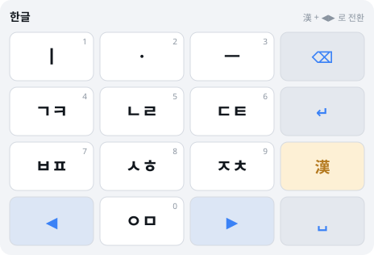
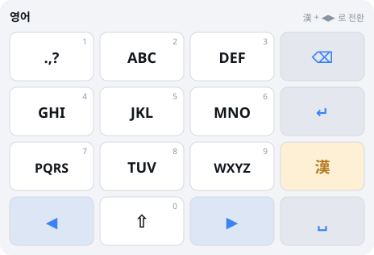
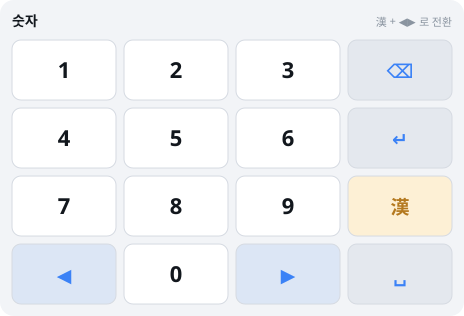

# 천지인 IME — 한자/기호 키 & 레이아웃 전환 스펙

> 문서 버전 1.0 / 2026-08-17
> [05-4×4 16키 스펙](05-4x4-16키-스펙.md)의 §4(한자/기호 키)를 대체·확장한다.
> 검증: `cd tools && python3 verify_mode.py` → 판정 16건, 실패 0건
>
> ⚠️ **키 배치는 [07-배치확정·미결검토](07-배치확정-미결검토.md)가 우선한다.**
> 본 문서 §5.2의 레이아웃 이미지는 최신 배치로 갱신됐으며, §10 미결 항목은 07에서 종결됐다.

---

## 1. 요구사항 정리

| # | 요구 | 해석 |
|---|---|---|
| R1 | 단어·글자 **블록(선택) 시** 한자/기호키 → **한자 변환** | 선택 영역이 변환 대상 |
| R2 | 그 외에는 → **기호 입력**, 화면에 떠서 선택 | 선택 없으면 기호 팔레트 |
| R3 | 한자/기호키 **+ 방향키 동시** → 레이아웃 전환 (한글/영어/숫자) | 코드(chord) 입력 |

세 요구가 **하나의 물리 키에 3가지 의미**를 부여한다. 충돌 없이 판정하는 것이 이 문서의 핵심이다.

---

## 2. 판정 규칙 — 단일 키, 3가지 의미

### 2.1 판정 트리

한자/기호 키(이하 `漢`)를 **누를 때가 아니라 뗄 때** 동작을 결정한다. 누르는 순간에는 이것이 단독 탭인지 코드의 시작인지 알 수 없기 때문이다.

```
漢 DOWN
  └─ 상태 기록만 (hj_down = true), 아무 동작 안 함
       │
       ├─ 방향키가 눌리면  ─────→ 레이아웃 전환 실행
       │                          hj_consumed = true 표시
       │
       └─ 漢 UP
            ├─ hj_consumed == true  → 아무 동작 없음 (이미 코드로 소비)
            ├─ 선택 영역 있음(한글) → 한자 변환 후보 표시
            └─ 그 외                → 기호 팔레트 표시
```

### 2.2 `hj_consumed` 플래그가 필수인 이유

이 플래그가 없으면 **코드를 뗄 때 기호 팔레트가 같이 뜬다.**

사용자가 `漢`+`▶`로 영어 레이아웃으로 바꾼 뒤 손을 떼면, `漢 UP` 이벤트가 발생한다. 이때 "선택 없음 → 기호 팔레트"라는 규칙이 그대로 적용되면, 레이아웃 전환과 동시에 원치 않는 팔레트가 열린다.

따라서 코드가 성립한 순간 `hj_consumed = true`로 표시하고, `漢 UP`에서 이 플래그를 확인해 동작을 건너뛴다. 참조 구현으로 검증된 항목이다.

### 2.3 상태별 완전 정의

| `漢` 상태 | 선택 영역 | 결과 |
|---|---|---|
| 단독 탭 | 한글 단어/글자 블록 | **한자 변환 후보** |
| 단독 탭 | 없음 | **기호 팔레트** |
| 단독 탭 | 한글 아님(영문/숫자) | 기호 팔레트 |
| 단독 **롱프레스** | 무관 | 기호 팔레트 강제 (한자 건너뜀) |
| `漢`+`◀` | 무관 | 레이아웃 **역방향** 전환 |
| `漢`+`▶` | 무관 | 레이아웃 **정방향** 전환 |

**선택 영역이 있어도 코드가 우선한다.** 한자 변환하려다 실수로 레이아웃이 바뀌는 것보다, 명시적으로 두 키를 함께 누른 의도를 존중하는 편이 예측 가능하다.

---

## 3. R1 — 한자 변환 (블록 선택 시)

### 3.1 변환 대상

| 선택 상태 | 대상 |
|---|---|
| 단어 블록 (`대한민국`) | 단어 전체를 한 단위로 변환 시도 → `大韓民國` |
| 글자 블록 (`국`) | 한 글자 변환 → `國, 局, 菊, 鞠...` |
| 선택 없음 + 조합 중 | 조합 중 음절을 확정 후 변환 |

단어 단위 변환을 먼저 시도하고, 사전에 없으면 글자 단위로 분해해 후보를 제시한다. `대한민국`처럼 관용 표기가 있는 단어를 글자별로 4번 변환시키는 것은 불필요한 노동이다.

### 3.2 후보 UI

후보는 **자판 상단 바**에 가로로 표시한다. 팝업이 아니라 바인 이유는 4×4 자판이 이미 화면 하단을 차지하고 있어, 팝업이 뜨면 원문 텍스트를 가리기 때문이다.

```
┌────────────────────────────────────────┐
│ 國  局  菊  鞠  麴  掬        1/2  ▸    │  ← 후보 바
├────────────────────────────────────────┤
│  ㅣ    ㆍ    ㅡ    ⌫                    │
│  ㄱㅋ  ㄴㄹ  ㄷㅌ  漢                    │
│  ...                                    │
└────────────────────────────────────────┘
```

| 조작 | 동작 |
|---|---|
| `◀` `▶` | 후보 이동 |
| 후보 직접 터치 | 즉시 선택·확정 |
| `↵` | 현재 후보 확정 |
| `⌫` | 후보 취소, 원래 한글 유지 |
| 글자키 입력 | 후보 취소 후 일반 입력 계속 |
| `漢` 다시 탭 | 다음 후보 페이지 |

**후보 창이 열린 동안 방향키는 후보 탐색으로 전용된다.** 커서 이동이 아니다. 이 모드 전환은 후보 바의 존재 자체가 시각적 표시이므로 별도 인디케이터가 필요 없다.

### 3.3 후보 정렬

1. 최근 사용 순 (기기 내 학습)
2. 사용 빈도 순 (내장 통계)
3. 유니코드 코드포인트 순

한자 사전은 KS X 1001 한자 영역(4,888자)을 기본으로 하고, 확장은 KS X 1002를 옵션으로 둔다.

---

## 4. R2 — 기호 입력 (화면 선택)

선택 영역이 없을 때 `漢` 탭 → 기호 팔레트가 **화면에 떠서** 선택 가능하다.

### 4.1 팔레트 구조

자판 영역을 그대로 4×4 그리드로 덮어 표시한다. 새 창을 띄우지 않으므로 레이아웃 이동이 없고, 손 위치가 유지된다.

| 페이지 | 내용 |
|---|---|
| 1 (기본) | `.` `,` `?` `!` `~` `…` `'` `"` `(` `)` `:` `;` `-` `/` `@` `#` |
| 2 수학·단위 | `+` `-` `×` `÷` `=` `±` `%` `°` `℃` `₩` `$` `€` `¥` `№` `※` `★` |
| 3 괄호·화살표 | `[` `]` `{` `}` `〈` `〉` `《` `》` `「` `」` `←` `→` `↑` `↓` `↔` `⇒` |
| 4 이모지 | OS 제공 팔레트 연동 |

| 조작 | 동작 |
|---|---|
| `◀` `▶` | 페이지 전환 |
| 기호 터치 | 입력 후 팔레트 **유지** (연속 입력 가능) |
| 기호 롱프레스 | 입력 후 팔레트 **닫기** |
| `漢` 다시 탭 | 팔레트 닫기 |
| `⌫` | 팔레트 닫기 (입력 취소) |

기본을 "유지"로 둔 것은 `...`, `!!`, `()` 처럼 기호를 연달아 넣는 경우가 흔하기 때문이다.

### 4.2 자주 쓰는 기호 우선

1페이지 첫 4개(`.` `,` `?` `!`)는 사용 빈도가 압도적이므로 **좌상단 2×2**에 고정한다. 팔레트를 열자마자 엄지가 닿는 위치다.

---

## 5. R3 — 레이아웃 전환 (코드)

### 5.1 순환 구조

```
        ▶              ▶
  한글 ────→ 영어 ────→ 숫자
    ▲                     │
    └─────────────────────┘
              ▶
```

`◀`는 역방향(한글 → 숫자 → 영어 → 한글).

3개뿐이므로 어느 방향으로 가도 최대 1회로 목표에 도달한다. 양방향을 모두 제공하는 이유는 순환 방향을 외우지 않아도 되게 하기 위함이다.

### 5.2 세 레이아웃

**한글** (기본)



**영어** — **ITU-T E.161 국제 표준** 배분을 따른다. `⇧`로 대소문자 전환.



| 키 | 글자 | 키 | 글자 |
|---|---|---|---|
| 2 | A B C | 6 | M N O |
| 3 | D E F | 7 | **P Q R S** |
| 4 | G H I | 8 | T U V |
| 5 | J K L | 9 | **W X Y Z** |

E.161은 8키만 사용하므로 글자키 10개 중 2개가 남는다. 이 여유로 `PQRS`·`WXYZ`를 분할해 최대 탭수를 4→3으로 줄이는 안을 검토했고, 실측 결과 평균 2.155→2.069탭(**4% 개선**)이었다.

**그럼에도 E.161 표준을 따른다.** 4% 이득보다 전 세계 피처폰·리모컨·POS 단말에서 수십 년간 축적된 근육 기억과 키 각인 일치가 중요하다. 설계 원칙 P4("플랫폼 관례를 이긴다고 착각하지 않는다")의 적용이다.

4탭이 필요한 글자는 `S`와 `Z` **둘뿐**이며, 이는 롱프레스로 보상한다(`7` 롱프레스 = `S`, `9` 롱프레스 = `Z`). 남는 `1` 키에는 자주 쓰는 문장부호(`.` `,` `?`)를 배치했다.

**숫자** — `0~9` 직접 입력. 4×4 그리드에 정확히 들어맞는다.



**기능키 4개(`⌫` `漢` `↵` `␣`)와 방향키 2개는 세 레이아웃에서 위치·기능이 완전히 동일하다.** 레이아웃이 바뀌어도 편집 동작의 근육 기억은 유지된다.

### 5.3 전환 시 상태 처리

| 항목 | 처리 |
|---|---|
| 조합 중 한글 | **확정 후** 전환 |
| 열려 있던 후보 창/팔레트 | 닫음 |
| 멀티탭 세션 | 종료 |
| 커서 위치 | 유지 |

### 5.4 전환 피드백

레이아웃 전환은 화면 전체가 바뀌는 큰 변화이므로 명확한 피드백이 필요하다.

- 자판 좌상단에 현재 레이아웃명 표시 (`한글` / `영어` / `숫자`) — 상시 표시
- 전환 순간 150ms 크로스페이드
- 햅틱 Medium 1회
- 모션 감소 설정 시 페이드 없이 즉시 교체

---

## 6. 물리 키패드에서의 코드 입력

터치 스크린에서는 두 손가락으로 `漢`+방향키를 동시에 누를 수 있지만, **물리 4×4 키패드**(POS 단말, 리모컨)는 동시 입력(N-key rollover)을 지원하지 않을 수 있다.

### 6.1 폴백 — 순차 코드

동시 입력이 불가능한 하드웨어를 위해 **순차 모드**를 제공한다.

```
漢 누름 → (500ms 내) 방향키 누름 → 레이아웃 전환
```

`漢`을 누른 뒤 500ms 동안 "코드 대기 상태"로 두고, 이 사이에 방향키가 오면 코드로 판정한다. 시간 내 방향키가 없으면 단독 탭으로 처리한다.

**부작용**: 단독 탭의 반응이 500ms 지연된다. 따라서 이 모드는 **동시 입력 미지원 하드웨어에서만** 활성화하며, 터치 환경에서는 기본 비활성이다.

### 6.2 하드웨어별 기본값

| 환경 | 코드 방식 | 단독 탭 지연 |
|---|---|---|
| 터치 스크린 | 동시 누르기 | 없음 |
| 물리 키패드 (rollover 지원) | 동시 누르기 | 없음 |
| 물리 키패드 (미지원) | 순차 (500ms) | 500ms |

---

## 7. 접근성

코드 입력은 **두 키를 동시에 눌러야 하므로 운동 장애 사용자에게 장벽**이 된다. 대체 경로가 반드시 필요하다.

| 대체 수단 | 동작 |
|---|---|
| `漢` 더블탭 | 레이아웃 전환 (정방향) |
| 고정 키(Sticky Keys) 모드 | `漢` 탭 → 방향키 탭 (순차, 시간 제한 없음) |
| 스크린리더 | 전환 시 "영어 레이아웃" 음성 공지 |

고정 키 모드는 §6.1의 순차 코드와 유사하지만 **시간 제한이 없다**는 점이 다르다. 접근성 설정에서 켜면 `漢`을 누른 뒤 몇 초가 지나도 방향키를 기다린다.

### 7.1 스크린리더 레이블

| 상황 | 레이블 |
|---|---|
| `漢` 평상시 | "한자 기호 키. 두 번 누르면 레이아웃 전환" |
| 선택 영역 있을 때 | "한자 변환. 대한민국을 한자로 변환합니다" |
| 후보 창 열림 | "한자 후보, 6개 중 1번째, 나라 국" |
| 레이아웃 전환 후 | "영어 레이아웃" |

---

## 8. 상태 머신 (참조 구현)

`tools/modefsm.py`가 이 문서의 판정 규칙을 구현한다. 조합 엔진(`engine.py`)과 **분리된 셸 계층**이다 — 레이아웃·팔레트·코드는 텍스트 조합과 무관한 UI 상태이기 때문이다.

```python
handle(state, event, has_selection, selection_is_hangul, composing)
# event: HJ_DOWN | HJ_UP | LEFT_DOWN | RIGHT_DOWN | ESC
```

### 8.1 검증된 시나리오

| # | 시나리오 | 기대 | 결과 |
|---|---|---|---|
| 1 | 블록 선택 + `漢` 탭 | 한자 후보 | ✅ |
| 2 | 선택 없음 + `漢` 탭 | 기호 팔레트 | ✅ |
| 3 | 영문 선택 + `漢` 탭 | 기호 팔레트 | ✅ |
| 4 | `漢`+`▶` → `漢` 뗌 | 레이아웃만 전환, 팔레트 안 뜸 | ✅ |
| 5 | `漢`+`◀` | 역방향(숫자) | ✅ |
| 6 | 코드 정방향 3회 | 한글로 순환 복귀 | ✅ |
| 7 | 코드 역방향 3회 | 한글로 순환 복귀 | ✅ |
| 8 | 블록 선택 중 코드 | 한자 변환 아닌 레이아웃 전환 | ✅ |
| 9 | 후보 창 열린 뒤 방향키 | 후보 탐색 | ✅ |
| 10 | 후보 창 중 코드 | 후보 닫고 전환 | ✅ |
| 11 | 팔레트 중 코드 | 팔레트 닫고 전환 | ✅ |
| 12 | 조합 중 `▶` | 조합 확정 | ✅ |
| 13 | 조합 없음 `▶` | 커서 이동 | ✅ |
| 14 | `ESC` | 팝업 전체 닫힘 | ✅ |
| 15 | 영어 레이아웃 E.161 준수 | 26자 전체 매핑 | ✅ |
| 16 | E.161 최대 탭수 | 4 (S, Z) | ✅ |

**전 항목 통과 (16/16, 실패 0건).**


---

## 9. 05 문서 대비 변경 사항

| 항목 | 05 스펙 | 본 문서 |
|---|---|---|
| 한자 변환 트리거 | 직전 음절 자동 대상 | **선택 영역(블록) 기준** |
| 기호 팔레트 | 짧게 누름 | 선택 없을 때 짧게 (동일하나 조건 명시) |
| 레이아웃 전환 | 미정의 (숫자는 팔레트 0페이지) | **`漢`+방향키 코드, 3개 순환** |
| 숫자 입력 | 기호 팔레트 0페이지 | **독립 숫자 레이아웃** |
| 영어 입력 | 미정의 | **독립 영어 레이아웃 (12키 멀티탭)** |

05 문서 §4와 §5.1(숫자 입력)은 본 문서로 대체된다.

---

## 10. 남은 검토 사항

| 항목 | 내용 |
|---|---|
| 한자 사전 크기 | KS X 1001(4,888자) 기본. 앱 용량 vs 커버리지 트레이드오프 |
| 단어 단위 한자 변환 사전 | 관용 표기 사전 별도 필요. 초기 규모 산정 필요 |
| S·Z 롱프레스 | E.161 4탭 보상책. 다른 키의 롱프레스(숫자/쌍자음)와 일관성 검토 필요 |
| 코드 오발동 | `漢`을 누른 채 실수로 방향키를 스치는 경우. 실사용 데이터로 임계값 조정 |
